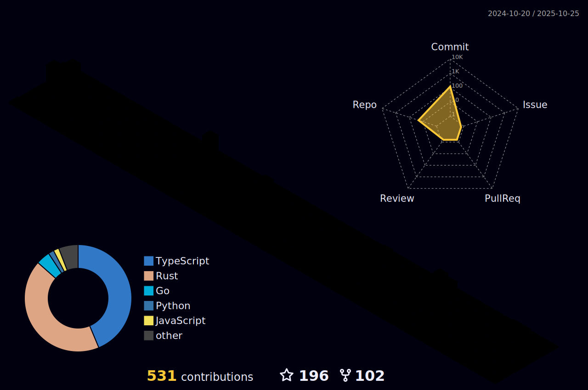

# 👋 Hi, I'm A.S 

**Senior Fullstack Blockchain Developer** specializing in Web3 games, NFT minting, token launchpads, and automated trading bots. With extensive experience across multiple chains — including Solana, Raydium, Xverse, Magic Eden, and Unisat — I turn innovative ideas into performant, secure dApps. 🌐

## 🛠️ Tech Stack

- **Languages**: TypeScript, Rust, Python, Solidity, PHP, Vue.js, Unity/C#
- **Chains & Frameworks**: Solana, Raydium, Xverse, Magic Eden, Unisat, Metaplex, Bubblegum, CLMM
- **Tools**: GitHub Actions, Docker, Kubernetes, Proxy rotation, 2captcha, CI/CD pipelines

  
## 📫 Contact Me
---

<!--
**** is a ✨ _special_ ✨ repository because its `README.md` (this file) appears on your GitHub profile.

Here are some ideas to get you started:

- 🔭 I’m currently working on ...
- 🌱 I’m currently learning ...
- 👯 I’m looking to collaborate on ...
- 🤔 I’m looking for help with ...
- 💬 Ask me about ...
- 📫 How to reach me: ...
- 😄 Pronouns: ...
- ⚡ Fun fact: ...
-->

