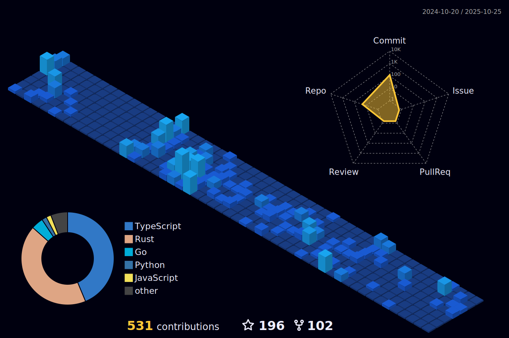

# 👋 Hi, I'm A.S 

**Senior Fullstack Blockchain Developer** specializing in Web3 games, NFT minting, token launchpads, and automated trading bots. With extensive experience across multiple chains — including Solana, Raydium, Xverse, Magic Eden, and Unisat — I turn innovative ideas into performant, secure dApps. 🌐

- 🔭 Currently exploring AI-driven strategies for automated trading systems  
- 🚀 619+ followers and 2.1k following on GitHub :contentReference[oaicite:1]{index=1}  
- 💡 Arctic Code Vault contributor and Developer Program member  
- 🌍 Fully remote

## 🛠️ Tech Stack

- **Languages**: TypeScript, Rust, Python, Solidity, PHP, Vue.js, Unity/C#
- **Chains & Frameworks**: Solana, Raydium, Xverse, Magic Eden, Unisat, Metaplex, Bubblegum, CLMM
- **Tools**: GitHub Actions, Docker, Kubernetes, Proxy rotation, 2captcha, CI/CD pipelines

---

- Advanced DeFi protocols & AMM simulations (Raydium, CLMM)
- AI-driven trading algorithms  
- Scaling Web3 games with on-chain data and off-chain optimizations

---

## 📫 Contact Me

- GitHub: `@am263129`  
- Email: [mufasa263129@gmail.com]

---

## 📚 Favorite Reads & Resources

| Topic                | Resource |
|----------------------|----------|
| Wallet & Blockchain Basics | Metaplex Docs, Solana Cookbook |
| DeFi & AMM Models   | Raydium, Bubblegum CLMM |
| Bot & Script Automation | Python + 2captcha |  

---

🛠️ Feel free to explore my repositories and reach out if you'd like to collaborate!

<!--
**** is a ✨ _special_ ✨ repository because its `README.md` (this file) appears on your GitHub profile.

Here are some ideas to get you started:

- 🔭 I’m currently working on ...
- 🌱 I’m currently learning ...
- 👯 I’m looking to collaborate on ...
- 🤔 I’m looking for help with ...
- 💬 Ask me about ...
- 📫 How to reach me: ...
- 😄 Pronouns: ...
- ⚡ Fun fact: ...
-->

